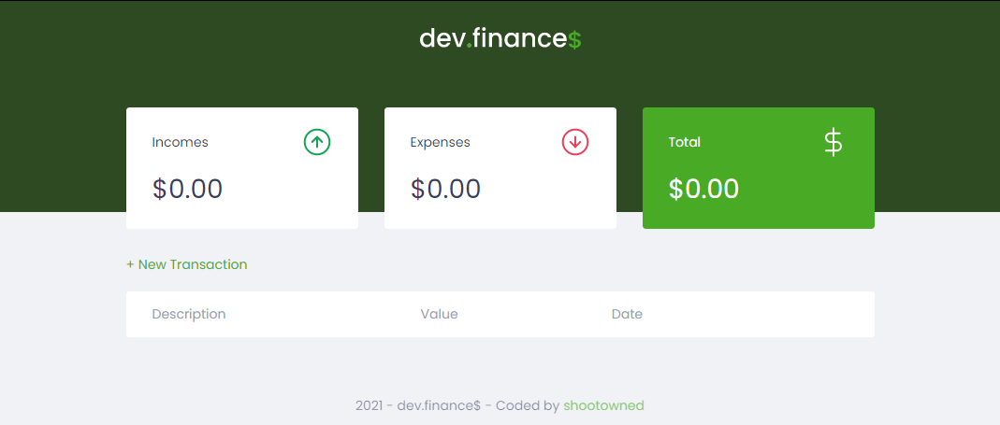
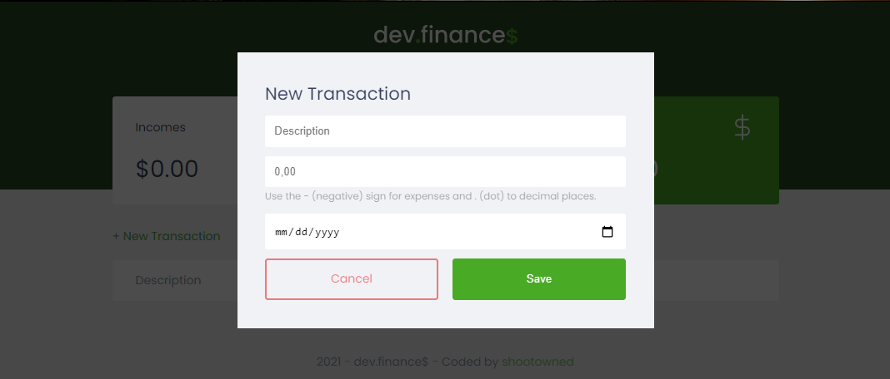
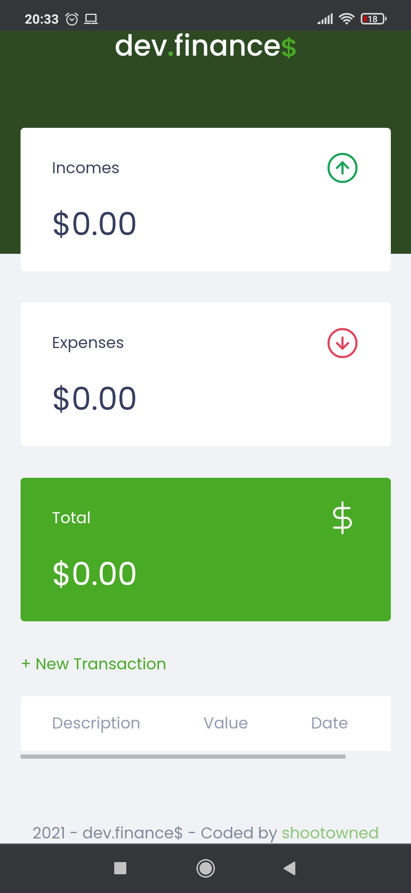
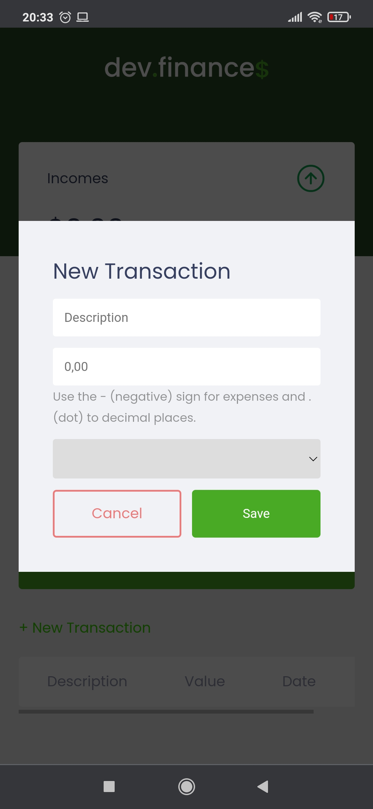

  

    <h1 align="center">👾 Maratona Discover - dev.finance$ 👾</h1>
    
During the Discover Marathon, it was presented on practice the knowledge earned on the Rocketseat Discover module, as a plus, I implemented a Dark Theme using the knowledge about HTML, CSS, and JavaScript.

<h1>🚀 Technologies</h1>

  * HTML
  * CSS
  * JavaScript

<h1>💻 Project</h1>

  
    

   
  

The dev.finance$ is an application to finance control, where is possible to create and delete transactions and see the total amount. It shall be used to control the expenses and incomes and verify the balance. It was used the LocalStorage to storage the application data.

The project can be tested at this <a href="https://shootowned.github.io/Marathon_Discover_01/" target="_blank">link</a>

<h1>🚧 Next Steps</h1>

------------------

<h1>📝 License</h1>

This project is under MIT lincense. See the attached file LICENSE for more details.

